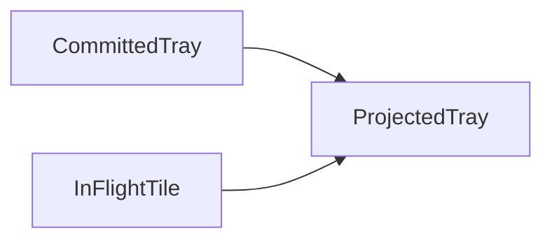

# Game model (`lib/game-model.js`)

Pure functions for tray rules and **committed** vs **projected** occupancy. The live game in `game.js` still owns animation queues, DOM, and board layering; this module is the single source of truth for insert order, triple scoring/removal, and tray-capacity predicates so behavior cannot drift from tests.

See [ANIMATIONS.md](ANIMATIONS.md) for how fly/combine timing interacts with state updates.

## Terminology

| Term | Meaning |
|------|--------|
| **Committed** | Authoritative tray and board the engine uses for rules: `state.trayTiles`, `state.boardTiles`, score. After a tile lands, `applyMove` updates committed state. When combine animations **start**, matched triples are **removed from committed tray immediately** (solver parity) even though visuals may still be animating. |
| **Projected** | Tray used for “is there room?” before the in-flight tile is committed: **committed tray** plus the **flying** `{ id, type }` (if any). Same idea as the former `getProjectedTray()` in `game.js`. The module does not mutate the committed tray when building a projection. |
| **Settled** | Engine idle: no fly, no combine-in-progress flags, apply queue drained—when `checkAllIdle()` in `game.js` can complete. Settled is **orchestration**, not defined inside this module; committed state may already reflect post-triple-removal before the combine animation finishes. |

## Constants

- **`TRAY_MAX_TILES`** (`7`) — maximum tray slots; overflow rules use this with projected length.

## API

### `getTrayInsertIndexForType(trayTiles, type) → number`

Index where a new tile of `type` is inserted (grouped after the last tile of the same type, else end).

### `insertTrayTileByShape(trayTiles, newTile) → trayTiles’`

New array; `newTile` is `{ id, type }`. Does not mutate `trayTiles`.

### `removeMatchingTriplesOneRound(trayTiles) → { trayTiles, scoreDelta, removedTypes }`

One **full** round: compute types with count ≥ 3 at the start, then for each such type (in `Object.keys(counts)` order) remove the first three left-to-right and add **30** score per type removed. Matches `handleMatchingInTray()`.

### `removeTriplesForTypesSequential(trayTiles, typesInOrder) → { trayTiles, scoreDelta, removedTypes }`

Same removal loop as above but only for the given type list, in order (used by the animated path’s test/skip branch when some types are excluded because they are already combining).

### `getProjectedTray(committedTrayTiles, flyingTileRef | null) → { trayTiles, length }`

Shallow copy of committed tray; if `flyingTileRef` is set (`{ id, type }`), inserts it as if it had landed. **`length`** equals `trayTiles.length`.

### `shouldTriggerTrayOverflowLoss(projectedLength, combiningTypesCount) → boolean`

`projectedLength >= TRAY_MAX_TILES` and no combine animation in flight (`combiningTypesCount === 0`): should trigger loss, not queue.

### `shouldQueueWaitForRoom(projectedLength, combiningTypesCount) → boolean`

Projected tray full but `combiningTypesCount > 0`: next click should wait for room instead of losing.

### `applyCommittedPick({ boardTiles, trayTiles, score }, tileId)`

Instant-move path (no fly): validates tray not full and tile tappable data, marks board tile removed, inserts into tray, runs `removeMatchingTriplesOneRound` once.

- **Success:** `{ ok: true, boardTiles, trayTiles, score, removedTypes, scoreDelta }`
- **Failure:** `{ ok: false, error}`, `error` is `'tray_full'` or `'invalid_tile'`

Callers update `stats.tilesClearedTotal` / `saveStats` as the shell does today.

## Example

Committed tray has **6** tiles; user has a tile **flying** toward the slot (not yet in `state.trayTiles`). `getProjectedTray(committed, flyingRef).length === 7`. If `_combiningTypes.length > 0`, a new click should **queue** (`shouldQueueWaitForRoom`); if not, **loss** (`shouldTriggerTrayOverflowLoss`).

## Invariants

- Functions never read `window` or mutate input tray/board arrays in place.
- Projected tray helpers return new arrays; committed inputs stay unchanged.
